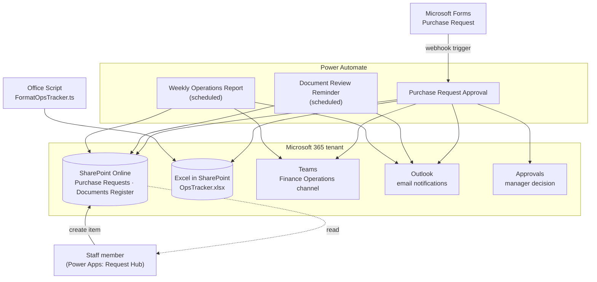

# Architecture

## How the pieces connect

## Design at a glance

- **SharePoint is the single source of truth.** Every flow reads from or writes to the same two lists, so a person can always see the real state in the list view — no hidden state inside a flow.
- **Forms and Power Apps are interchangeable front doors.** The approval flow triggers from a Form; the Power Apps Request Hub writes directly to the same list and reads it back for tracking. A team can adopt either without changing the back end.
- **Notifications fan out, decisions converge.** Teams and Outlook are notification sinks only. The one place a human decision enters the system is the Approvals connector, and the flow branches on its single `outcome` value.
- **Excel is a reporting mirror, not a database.** Approved requests are appended to an Excel table purely so the team has a familiar surface for pivot tables; the Office Script formats and summarises it.

## Connections used

| Connector | API id | Used by |
|---|---|---|
| Microsoft Forms | `shared_microsoftforms` | Purchase Request Approval (trigger, get details) |
| SharePoint | `shared_sharepointonline` | all three flows |
| Approvals | `shared_approvals` | Purchase Request Approval |
| Microsoft Teams | `shared_teams` | Purchase Request Approval, Weekly Report |
| Office 365 Outlook | `shared_office365` | all three flows |
| Excel Online (Business) | `shared_excelonlinebusiness` | Purchase Request Approval |

## Setup sequence

1. **SharePoint** — `./sharepoint/provision-lists.ps1 -SiteUrl https://<tenant>.sharepoint.com/sites/Operations`. This creates `Purchase Requests` and `Documents Register` with the exact internal field names the flows reference (see `sharepoint/list-schemas.md`).
2. **Excel** — drop `OpsTracker.xlsx` in the site's Shared Documents library with a table named `PurchaseLog` (columns: RequestId, Item, Amount, Status, DecidedOn).
3. **Forms** — create a `Purchase Request` form with questions whose ids map to `r_item`, `r_amount`, `r_department`, `r_justification`, `r_manageremail`. Update the `form_id` in the trigger.
4. **Flows** — import via `solution-export/` or paste the definitions. Then open each flow and set the parameters at the top (site URL, recipients, threshold, channel).
5. **Test** — submit a low-value request (auto-approve path), then a high-value one (manager approval path), and confirm the SharePoint status, Teams post, email, and Excel row.

## Where to extend it

- Swap the Forms trigger for the Power Apps `Power Apps (V2)` trigger to drive everything from the app.
- Replace the Outlook approval email in the Logic App with the Teams Adaptive Card approval pattern.
- Add a `Do until` escalation loop to the reminder flow for documents that stay overdue.
